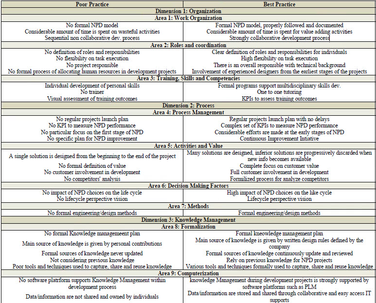

# Design a key stage of product lifecycle
Gero’s FBS model contains few aspects which needed to be updated for a usage of model-driven engineering in the context of Conceptual design

#### Key Points
- R (Requirements): requirements and use case diagrams
- F (Functions): represented with internal block diagram (black-box model: function-flow)
- Be (Expected behaviour): activity, sequence and statemachine diagrams
- Bs (Behaviour of the system): parametric and same diagrams as Be
- GS (Generic Structure): class diagram (with abstract
classes)
- S (Structure): class, components and deployment diagrams

#### The NPD Best Practices Framework

#### Resources
1. 

2 [USE method](http://www.brendangregg.com/USEmethod/use-linux.html)
